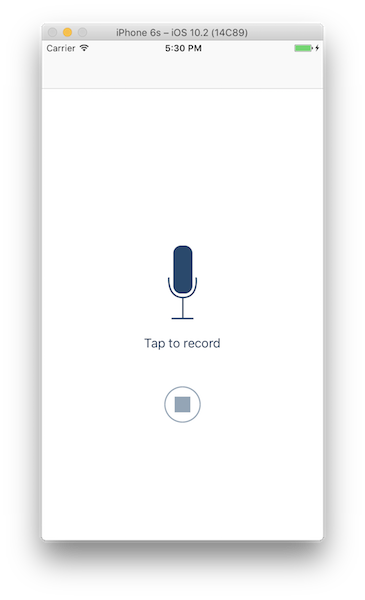
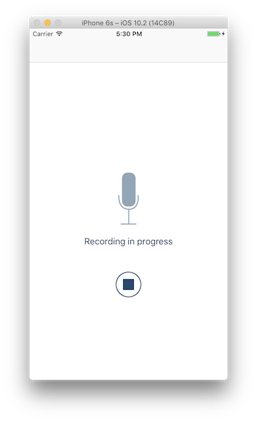
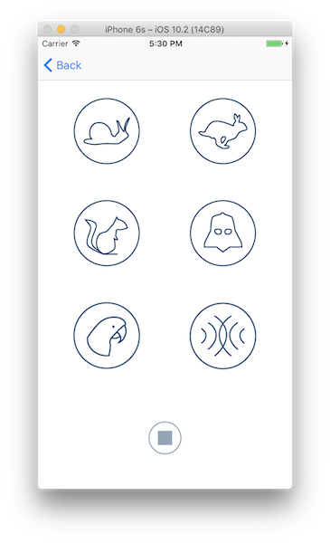
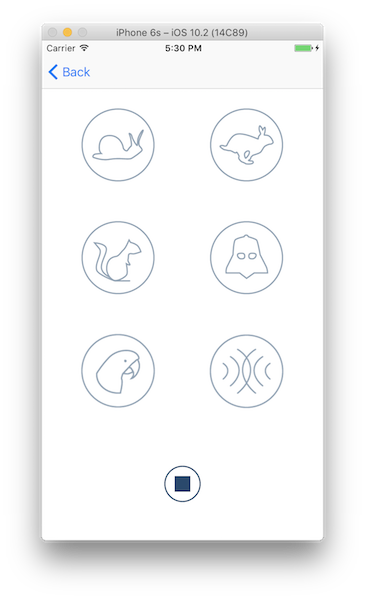

# udacity-ios-pitchPerfect

PitchPerfect is a project from the Udacity Course "Intro to iOS App Development with Swift":

https://www.udacity.com/course/intro-to-ios-app-development-with-swift--ud585

## Description

This iOS app records audio and offers a playback with various sound effects.

## Goals

* Get familiar with Xcode and the Interface Builder
* Add some buttons and labels and play around with constraints
* Set buttons active/inactive, change labels according to the state
* Add a second view controller, embed all in a navigation controller
* Create IBOutlets and IBActions
* Learn about AVFoundation and AVAudioRecorder
* Write some actual code

## User Interface

### Record Audio

### Playback Audio

